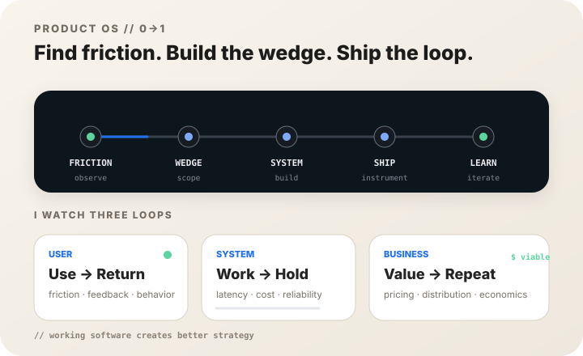

## Hi, I'm Mason 👋

I'm an **AI Product Builder** working at the intersection of **product strategy, applied AI, and real-world systems**.

I like turning ambiguous ideas into products that can actually be used — from local-first AI agents and browser inference, to workflow automation, data products, and interactive experiences.

My current focus is less about adding AI to existing software, and more about asking:

> **What becomes possible when AI is treated as part of the product architecture itself?**

- 🧠 Building **AI-native products, agents, and decision systems**
- ⚡ Exploring **local AI, WebGPU, browser inference, and edge computing**
- 🧩 Designing **workflows where humans, data, and agents collaborate**
- ☁️ Shipping with **Cloudflare, AWS, modern web stacks, and serverless infrastructure**
- 📈 Interested in **product strategy, systems thinking, and measurable impact**

 

---

## ⚡ Selected Builds

<table>
<tr>
<td width="50%" valign="top">

### 🧠 [HashAgent](https://github.com/mason131928/hashagent)

**Share an AI agent as a URL.**

A local-first, open-source agent platform where model inference runs directly in the browser through WebGPU — with no inference server, account, or tracking required.

`WebGPU` `WebLLM` `Transformers.js` `Cloudflare`

**→ [Try HashAgent](https://hashagent.pages.dev)**

</td>
<td width="50%" valign="top">

### 🧧 [月老值班中](https://imyuelao.com)

**A multiplayer 3D world built around the lifecycle of a wish.**

A stylized Taiwanese temple experience combining interactive storytelling, real-time multiplayer spaces, AI-assisted content, and cloud-native infrastructure.

`React` `R3F` `Hono` `D1` `Durable Objects` `Workers AI`

**→ [Enter the world](https://imyuelao.com)**

</td>
</tr>
<tr>
<td width="50%" valign="top">

### 📚 [SAGE](https://github.com/mason131928/SAGE)

**Semantic Agentic Generation Engine.**

An evidence-first report generation system for qualitative and mixed-method datasets, designed around full-dataset synthesis rather than thin retrieval slices.

`Agents` `Retrieval` `Evaluation` `Node.js` `SQLite`

**→ [View repository](https://github.com/mason131928/SAGE)**

</td>
<td width="50%" valign="top">

### 🐟 [BettaFish](https://github.com/mason131928/BettaFish)

**Multi-agent public-opinion analysis.**

An agentic analysis system combining search, multimodal understanding, private-data analysis, discussion, and report generation into one collaborative workflow.

`Multi-Agent` `LLM` `Search` `Analysis` `Python`

**→ [View repository](https://github.com/mason131928/BettaFish)**

</td>
</tr>
</table>

---

## What I Like Building

| Area | What interests me |
|---|---|
| **AI Products** | Agents, AI-native UX, tool use, model orchestration, evaluation |
| **Local & Edge AI** | WebGPU, browser inference, privacy-first AI, small models |
| **Product Systems** | Workflow design, automation, data loops, internal tools |
| **Cloud Architecture** | Serverless systems, edge runtimes, queues, storage, real-time state |
| **Impact & Decision Systems** | Evidence, measurement, reporting, human-in-the-loop workflows |

---

## 🛠 Tech I Work With

### Product & Application

### Data & Infrastructure

### AI & Agent Stack

`LLMs` · `AI Agents` · `RAG` · `WebLLM` · `Transformers.js` · `WebGPU` · `MCP` · `LangChain` · `pgvector` · `Qdrant`

---

## 📊 GitHub Activity

<picture>
  <source media="(prefers-color-scheme: dark)" srcset="https://github-readme-stats.vercel.app/api?username=mason131928&show_icons=true&hide_border=true&theme=github_dark&include_all_commits=true" />
  
</picture>

<picture>
  <source media="(prefers-color-scheme: dark)" srcset="https://github-readme-stats.vercel.app/api/top-langs/?username=mason131928&layout=compact&hide_border=true&theme=github_dark&langs_count=8" />
  
</picture>

 

<picture>
  <source media="(prefers-color-scheme: dark)" srcset="https://github-readme-activity-graph.vercel.app/graph?username=mason131928&theme=github-compact&hide_border=true&area=true" />
  
</picture>

---

## Principles I Build Around

**Start with the problem, not the model.**  
AI is useful when it changes the product experience or makes a system meaningfully more capable.

**Build the loop, not just the feature.**  
Good products learn from users, data, and outcomes — then turn that feedback into the next iteration.

**Ship things people can touch.**  
Strategy matters, but working software creates a much better conversation.

---

### Build → Ship → Learn → Repeat

**Mason Hsu · AI Product Builder · Taipei, Taiwan 🇹🇼**

<a href="https://github.com/mason131928">GitHub</a> · <a href="https://hashagent.pages.dev">HashAgent</a> · <a href="https://imyuelao.com">月老值班中</a>

