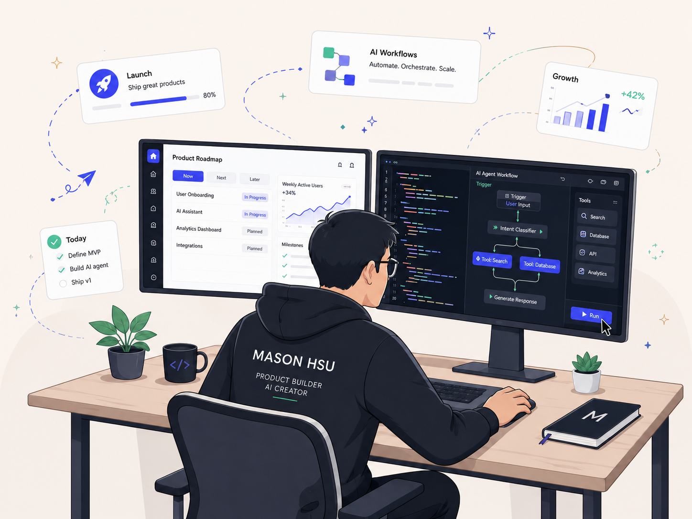
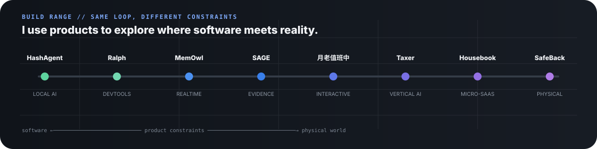

 

<picture>
  <source media="(prefers-color-scheme: dark)" srcset="https://readme-typing-svg.demolab.com?font=Fira+Code&amp;weight=600&amp;size=19&amp;duration=2800&amp;pause=850&amp;color=58A6FF&amp;center=true&amp;vCenter=true&amp;width=1080&amp;height=54&amp;lines=%E2%9A%A1+0%E2%86%921+PRODUCT+%C2%B7+AI-NATIVE+SYSTEMS+%C2%B7+VENTURE+EXPERIMENTS;%F0%9F%A7%A0+CPO+%26+HEAD+OF+AI+%40+GUPPY+DIGITAL+TECHNOLOGY;%F0%9F%9A%80+HEAD+OF+PRODUCT+%26+AI+%40+GDDAO;%F0%9F%8C%8F+TAIPEI%2C+TAIWAN+%C2%B7+BUILD+%E2%86%92+SHIP+%E2%86%92+LEARN+%E2%86%92+REPEAT" />
  
</picture>

---

## 01 / Product leader who still builds

I'm **Mason Hsu** — a product leader and hands-on builder working across **AI, product strategy, systems, and 0→1 ventures**.

I stay close to the whole loop: understand the problem, define the wedge, make the product and architecture tradeoffs, ship working software, then learn from users, latency, cost, reliability, and economics.

### Chief Product Officer (CPO) & Head of AI @ 孔雀魚數位科技 (Guppy Digital Technology)

I lead company-wide product strategy, AI team development, and AI R&D — from product direction and roadmap decisions to architecture, experimentation, and cross-functional delivery.

### Head of Product & AI @ [好事道 GDDAO](https://gddao.com)

**GDDAO is the flagship product I currently lead.** I connect data collection, automated analysis, AI agents, SROI / ESG / SDG workflows, and impact reporting into one product system.

| Operator signal | Scope |
|---|---|
| **~10-person cross-functional team** | Product, engineering, operations, and delivery coordination |
| **NT$5M AI R&D initiative** | Architecture definition for a government-supported AI program |
| **50+ NPOs · 15+ enterprises** | Platform adoption and real-world operating context |
| **ISO/IEC 27001:2022** | Execution lead for implementation |

 

---

## 02 / Products in market & open source

Four builds that best represent how I turn a product thesis into a working system.

<table>
<tr>
<td width="50%" valign="top">

 

### 🧠 [HashAgent](https://github.com/mason131928/hashagent)

<strong>LOCAL AI · OPEN SOURCE · LIVE</strong>

**Share an AI agent as a URL.**

A browser-first agent product where the definition lives in the URL and inference runs locally through WebGPU. The core experience needs no inference server, account, or tracking.

**Product bet:** useful AI does not always need a backend inference service.

`WebGPU` `WebLLM` `Transformers.js` `Cloudflare`

**[Try it ↗](https://hashagent.pages.dev)** &nbsp; **[Source ↗](https://github.com/mason131928/hashagent)**

 

</td>
<td width="50%" valign="top">

 

### 🧧 [月老值班中](https://imyuelao.com)

<strong>INTERACTIVE PRODUCT · 3D · REALTIME · LIVE</strong>

**A multiplayer 3D world built around the lifecycle of a wish.**

Six stylized Taiwanese temple worlds combine first/third-person exploration, realtime rooms, interactive storytelling, wish workflows, and AI-assisted content.

**Product bet:** cultural rituals can become playable digital systems without collapsing the experience into a chatbot.

`React` `R3F` `Hono` `D1` `R2` `Durable Objects` `Workers AI`

**[Enter the world ↗](https://imyuelao.com)**

 

</td>
</tr>
<tr>
<td width="50%" valign="top">

 

### 📚 [SAGE](https://github.com/mason131928/SAGE)

<strong>AI SYSTEMS · EVIDENCE · OPEN SOURCE</strong>

**Semantic Agentic Generation Engine.**

An evidence-first report-generation system for qualitative and mixed-method datasets, built around layered full-dataset synthesis, reviewable artifacts, retrieval, evaluation, and operational control.

**Product bet:** serious AI output needs traceability and evaluation — not just a thin retrieval slice.

`Agents` `Evaluation` `Retrieval` `Node.js` `SQLite`

**[View source ↗](https://github.com/mason131928/SAGE)**

 

</td>
<td width="50%" valign="top">

 

### 🦉 MemOwl

<strong>REALTIME AI · MEETING AGENT · PRIVATE BUILD</strong>

**A realtime meeting AI agent designed from the constraints backward.**

The build explicitly models provider quality, meeting unit cost, latency, backup/restore, privacy, release readiness, and realtime voice paths.

**Product bet:** realtime agents are latency / cost / reliability products, not prompt demos.

`Realtime` `Voice` `TypeScript` `Benchmarks` `Quality Gates`

 

</td>
</tr>
</table>

---

## 03 / Venture lab

Small, real experiments that test a **wedge, constraint, or business model** before over-investing.

<table>
<tr>
<td width="50%" valign="top">

 

### 🛡️ SafeBack

<strong>PHYSICAL COMPUTING · SAFETY · EARLY PROTOTYPE</strong>

A clip-on rear-vehicle warning concept for pedestrians, runners, roadside workers, and later riders. It explores mmWave radar, acoustic pre-warning, IMU filtering, TTC classification, haptic alerts, BLE, firmware, and a mobile shell.

**Constraint being tested:** can a safety product work locally, privately, and without depending on a phone or network for its core warning loop?

`ESP32-S3` `mmWave` `BLE` `C++` `React Native`

 

</td>
<td width="50%" valign="top">

 

### 🏠 Housebook

<strong>MICRO-SAAS · AUTOMATION · MONETIZATION</strong>

An AI guest-guide product for short-term-rental hosts: generate a preview from a listing, unlock the full guide through Stripe, then deliver a six-language guest experience.

The current build models a **$29 one-time product** with preview generation around **$0.04**.

**Constraint being tested:** can a narrow workflow become a self-serve, low-cost paid product?

`Cloudflare Workers` `Queues` `R2` `Stripe` `Resend` `Claude`

 

</td>
</tr>
<tr>
<td width="50%" valign="top">

 

### 🧾 Taxer

<strong>VERTICAL AI · TAIWAN TAX · PRIVATE BUILD</strong>

A Taiwan income-tax product that turns filing timelines, deductions, rules, calculators, and AI guidance into a guided decision flow instead of another wall of tax content.

It also experiments with AI-agent tools and AI-discovery surfaces alongside conventional SEO.

**Constraint being tested:** can a high-anxiety annual task become a clear, trustworthy guided product?

`Next.js` `AI Agent` `Tax Rules` `SEO / GEO`

 

</td>
<td width="50%" valign="top">

 

### 🔁 [Ralph for Codex](https://github.com/mason131928/codex-ralph-wiggum)

<strong>DEVTOOLS · AGENT RUNTIME · OPEN SOURCE</strong>

A recoverable loop controller for Codex that turns “keep working until the condition is actually satisfied” into an explicit state machine with persisted history, status, cancel, resume, watch, dashboard, and campaign operations.

**Constraint being tested:** how do you make long-running agent work observable and recoverable instead of magical?

`Codex` `State Machine` `Shell` `Observability`

**[View source ↗](https://github.com/mason131928/codex-ralph-wiggum)**

 

</td>
</tr>
</table>

 

---

## 04 / Product + engineering range

I don't try to be the deepest specialist in every layer. I understand enough of each layer to make **better product tradeoffs** and move a 0→1 build forward without hand-waving the hard parts.

| Layer | What I work with |
|---|---|
| **Product** | Problem discovery · PRD · UX · scope · pricing · GTM · experiments · instrumentation |
| **AI systems** | Agents · tool use · evals · RAG · realtime · multimodal · MCP · local inference |
| **Application** | TypeScript · React · Next.js · Node.js · Hono · Python |
| **Edge / cloud** | Cloudflare Workers · D1 · R2 · KV · Durable Objects · Queues · AWS · Docker |
| **Data** | PostgreSQL · SQLite · Redis · pgvector · Qdrant |
| **Local / device** | WebGPU · WebLLM · Transformers.js · BLE · firmware prototypes |
| **Operating concerns** | Cost · latency · reliability · privacy · safety · release gates · observability |

---

## 05 / How I think about building

| Principle | What it changes |
|---|---|
| **Problem > model** | Start with user friction. AI earns its place when it changes what the product can do. |
| **Unit economics are architecture** | Latency, inference cost, queueing, storage, and support cost shape the product early. |
| **Failure modes are product design** | Fallbacks, recovery, privacy, safety, and observability belong in the experience. |
| **Ship small · instrument early** | A working wedge with real signals teaches more than a large speculative roadmap. |
| **Working software creates better strategy** | Ideas improve when they touch reality. |

---

## 06 / Connect with me

  
  
  
  
  

  
  

### Building in public

I keep public repositories focused on things that are useful to inspect, run, fork, or argue with: **[HashAgent](https://github.com/mason131928/hashagent)**, **[SAGE](https://github.com/mason131928/SAGE)**, and **[Ralph for Codex](https://github.com/mason131928/codex-ralph-wiggum)**.

<picture>
  <source media="(prefers-color-scheme: dark)" srcset="https://github-readme-activity-graph.vercel.app/graph?username=mason131928&amp;theme=github-compact&amp;hide_border=true&amp;area=true" />
  
</picture>

---

### Build the wedge. Ship the system. Learn from reality.

**Mason Hsu · CPO & Head of AI · Head of Product & AI @ GDDAO · Taipei, Taiwan 🇹🇼**

