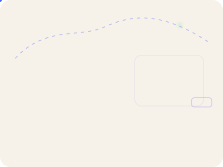

 

<picture>
  <source media="(prefers-color-scheme: dark)" srcset="https://readme-typing-svg.demolab.com?font=Fira+Code&weight=600&size=19&duration=2800&pause=850&color=58A6FF&center=true&vCenter=true&width=1080&height=54&lines=%E2%9A%A1+0%E2%86%921+PRODUCT+%C2%B7+AI-NATIVE+SYSTEMS+%C2%B7+VENTURE+EXPERIMENTS;%F0%9F%A7%A0+CPO+%26+HEAD+OF+AI+%40+GUPPY+DIGITAL+TECHNOLOGY;%F0%9F%9A%80+HEAD+OF+PRODUCT+%26+AI+%40+GDDAO;%F0%9F%8C%8F+TAIPEI%2C+TAIWAN+%C2%B7+BUILD+%E2%86%92+SHIP+%E2%86%92+LEARN+%E2%86%92+REPEAT" />
  
</picture>

 

  

---

## 01 / Product leader who still builds

I'm **Mason Hsu** — a product leader and hands-on builder working across **AI, product strategy, systems, and 0→1 ventures**.

I like staying close to the whole loop: **find the problem → define the wedge → make the product and architecture tradeoffs → ship → measure → iterate.**

### Chief Product Officer (CPO) & Head of AI @ 孔雀魚數位科技 (Guppy Digital Technology)

I lead **company-level product strategy, AI team development, and AI R&D** — connecting roadmap decisions with architecture, experimentation, and cross-functional execution.

### Head of Product & AI @ [好事道 GDDAO](https://gddao.com)

**GDDAO is the flagship product I currently lead.** I own product direction and AI capabilities across data collection, automated analysis, agents, SROI / ESG / SDG workflows, and impact reporting.

| Operator signal | Scope |
|---|---|
| **~10-person cross-functional team** | Product · engineering · operations · delivery |
| **NT$5M AI R&D initiative** | AI architecture for a government-supported R&D program |
| **50+ NPOs · 15+ enterprises** | Real-world platform adoption and operating context |
| **ISO/IEC 27001:2022** | Implementation execution lead |

> `DISCOVER → DEFINE → BUILD → SHIP → MEASURE → ITERATE`

 

---

## 02 / Flagship builds

The projects that best represent how I think about **product bets, system constraints, and shipping**.

<table>
<tr>
<td width="50%" valign="top">
 

### 🧠 [HashAgent](https://github.com/mason131928/hashagent)

LOCAL AI · OPEN SOURCE · LIVE

 

**Share an AI agent as a URL.**

A browser-first agent product where definitions live in the URL and inference runs locally through WebGPU — no inference server, account, or tracking required for the core experience.

**Product thesis:** useful AI does not always need a backend inference service.

`WebGPU` `WebLLM` `Transformers.js` `Cloudflare`

 

**[Try it →](https://hashagent.pages.dev)** &nbsp; **[Source →](https://github.com/mason131928/hashagent)**

 
</td>
<td width="50%" valign="top">
 

### 🧧 [月老值班中](https://imyuelao.com)

INTERACTIVE PRODUCT · 3D · REALTIME · LIVE

 

**A multiplayer 3D world built around the lifecycle of a wish.**

Six stylized Taiwanese temple worlds combine first/third-person exploration, realtime rooms, interactive storytelling, wish workflows, and AI-assisted content.

**Product thesis:** cultural rituals can become playable digital systems without turning into another chatbot.

`React` `R3F` `Hono` `D1` `R2` `Durable Objects` `Workers AI`

 

**[Enter the world →](https://imyuelao.com)**

 
</td>
</tr>
<tr>
<td width="50%" valign="top">
 

### 📚 [SAGE](https://github.com/mason131928/SAGE)

AI SYSTEMS · EVIDENCE · OPEN SOURCE

 

**Semantic Agentic Generation Engine.**

An evidence-first report-generation system for qualitative and mixed-method datasets, built around full-dataset synthesis, reviewable artifacts, retrieval, evaluation, and operational control.

**Product thesis:** serious AI output needs traceability and evaluation — not just retrieval.

`Agents` `Evaluation` `Retrieval` `Node.js` `SQLite`

 

**[View source →](https://github.com/mason131928/SAGE)**

 
</td>
<td width="50%" valign="top">
 

### 🦉 MemOwl

REALTIME AI · MEETING AGENT · PRIVATE BUILD

 

**A realtime meeting AI agent designed from the constraints backward.**

The build explicitly models provider quality, meeting unit cost, latency, backup/restore, privacy, release readiness, and realtime voice paths before calling the product “done.”

**Product thesis:** realtime agents are latency / cost / reliability products, not prompt demos.

`Realtime` `Voice` `TypeScript` `Benchmarks` `Quality Gates`

  
</td>
</tr>
</table>

---

## 03 / Venture lab

I build small, real experiments to test a **wedge, business model, or hard constraint** before over-investing.

<table>
<tr>
<td width="50%" valign="top">
 

### 🛡️ SafeBack

PHYSICAL COMPUTING · SAFETY · EARLY PROTOTYPE

 

A clip-on rear-vehicle warning concept for pedestrians, runners, roadside workers, and later riders — exploring mmWave radar, acoustic pre-warning, IMU filtering, TTC classification, haptics, BLE, firmware, and a mobile shell.

**Constraint:** can the core warning loop work locally and privately without depending on a phone or network?

`ESP32-S3` `mmWave` `BLE` `C++` `React Native`

  
</td>
<td width="50%" valign="top">
 

### 🏠 Housebook

MICRO-SAAS · AUTOMATION · MONETIZATION

 

An AI guest-guide product for short-term-rental hosts: generate a preview from a listing, unlock the full guide through Stripe, then deliver a six-language guest experience.

The experiment includes queues, email, a paywall, scraping/fallback paths, and explicit unit economics — **$29 one-time** with preview generation around **$0.04** in the current build.

**Constraint:** can a narrow workflow become a self-serve, low-cost paid product?

`Workers` `Queues` `R2` `Stripe` `Resend` `Claude`

  
</td>
</tr>
<tr>
<td width="50%" valign="top">
 

### 🧾 Taxer

VERTICAL AI · TAIWAN TAX · PRIVATE BUILD

 

A Taiwan income-tax product that turns filing timelines, deductions, rules, calculators, and AI guidance into a guided decision flow instead of another wall of tax content.

It also experiments with agent tools and AI-discovery surfaces alongside conventional SEO.

**Constraint:** can a high-anxiety annual task become a clear, trustworthy guided product?

`Next.js` `AI Agent` `Tax Rules` `SEO / GEO`

  
</td>
<td width="50%" valign="top">
 

### 🔁 [Ralph for Codex](https://github.com/mason131928/codex-ralph-wiggum)

DEVTOOLS · AGENT RUNTIME · OPEN SOURCE

 

A recoverable loop controller for Codex that turns “keep working until the condition is actually satisfied” into an explicit state machine with persisted history, status, cancel, resume, watch, dashboard, and campaign operations.

**Constraint:** how do you make long-running agent work observable and recoverable instead of magical?

`Codex` `State Machine` `Shell` `Observability`

 

**[View source →](https://github.com/mason131928/codex-ralph-wiggum)**

 
</td>
</tr>
</table>

---

## 04 / Product + engineering range

I don't optimize for being the deepest specialist in every layer. I optimize for understanding enough of each layer to make **better product tradeoffs** and move a 0→1 build forward without hand-waving the hard parts.

| Layer | What I work with |
|---|---|
| **Product** | Discovery · PRD · UX · scope · pricing · GTM · experiments · instrumentation |
| **AI systems** | Agents · tool use · evals · RAG · realtime · multimodal · MCP · local inference |
| **Application** | TypeScript · React · Next.js · Node.js · Hono · Python |
| **Edge / cloud** | Cloudflare Workers · D1 · R2 · KV · Durable Objects · Queues · AWS · Docker |
| **Data** | PostgreSQL · SQLite · Redis · pgvector · Qdrant |
| **Local / device** | WebGPU · WebLLM · Transformers.js · BLE · firmware prototypes |
| **Operating concerns** | Cost · latency · reliability · privacy · safety · release gates · observability |

---

## 05 / Things I believe about building

**`PROBLEM > MODEL`** — AI earns its place when it changes what the product can actually do.  
**`UNIT ECONOMICS ARE ARCHITECTURE`** — latency, inference cost, queues, storage, and support shape the product early.  
**`FAILURE MODES ARE PRODUCT DESIGN`** — fallback, recovery, privacy, safety, and observability belong in the experience.  
**`SHIP SMALL · INSTRUMENT EARLY`** — a working wedge with real signals teaches more than a speculative roadmap.  
**`WORKING SOFTWARE CREATES BETTER STRATEGY`** — the fastest way to sharpen an idea is often to make it touch reality.

---

## 06 / Find me elsewhere

**Building products in Taiwan. Exploring markets globally.**

 

<a href="https://www.linkedin.com/in/mason131928/">LinkedIn</a> ·
<a href="https://x.com/mason131928">X / @mason131928</a> ·
<a href="https://substack.com/@mason131929">Substack</a> ·
<a href="https://www.masonfoundry.com/">Mason Foundry LLC</a> ·
<a href="https://gddao.com">GDDAO</a> ·
<a href="https://hashagent.pages.dev">HashAgent</a> ·
<a href="https://imyuelao.com">月老值班中</a>

  

<picture>
  <source media="(prefers-color-scheme: dark)" srcset="https://github-readme-activity-graph.vercel.app/graph?username=mason131928&theme=github-compact&hide_border=true&area=true" />
  
</picture>

 

### Build the wedge. Ship the system. Learn from reality.

**Mason Hsu · CPO & Head of AI · Head of Product & AI @ GDDAO · Taipei, Taiwan 🇹🇼**

